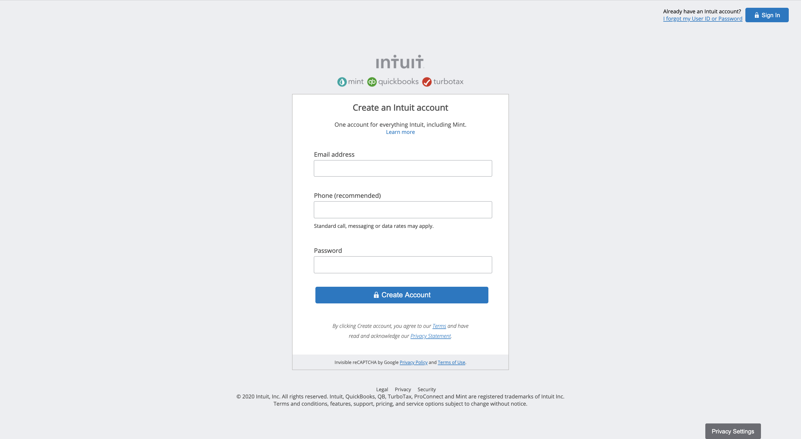

# HTML Forms

> A clone of mint.com's signup page.

 

This project demonstrates the use of forms on webpages, as one might use signing up for an account.

## Built With

- HTML
- CSS

## Live Demo

[Live Demo Link](https://rawcdn.githack.com/m15e/html-forms/tree/mint-signup-form)

## Getting Started

To access this project, download the contents of this repository and open the index.html file on the browser of your choosing.

### Prerequisites

Just a computer, some space on your hard-drive and a browser of your choosing!

## Authors

👤 **Joe Burke**

- Github: [@githubhandle](https://github.com/Joseph-Burke)

👤 **Mark Rode**

- Github: [@githubhandle](https://github.com/m15e)

## 🤝 Contributing

Contributions, issues and feature requests are welcome! 

Feel free to check the [issues page](issues/).

## Show your support

Give a ⭐️ if you like this project!

## Acknowledgments

- Thanks go to mint.com for its well-designed signup page.
- The Odin Project has our appreciation for its excellent resources on the use of forms on webpages.

## 📝 License

This project is [MIT](lic.url) licensed.